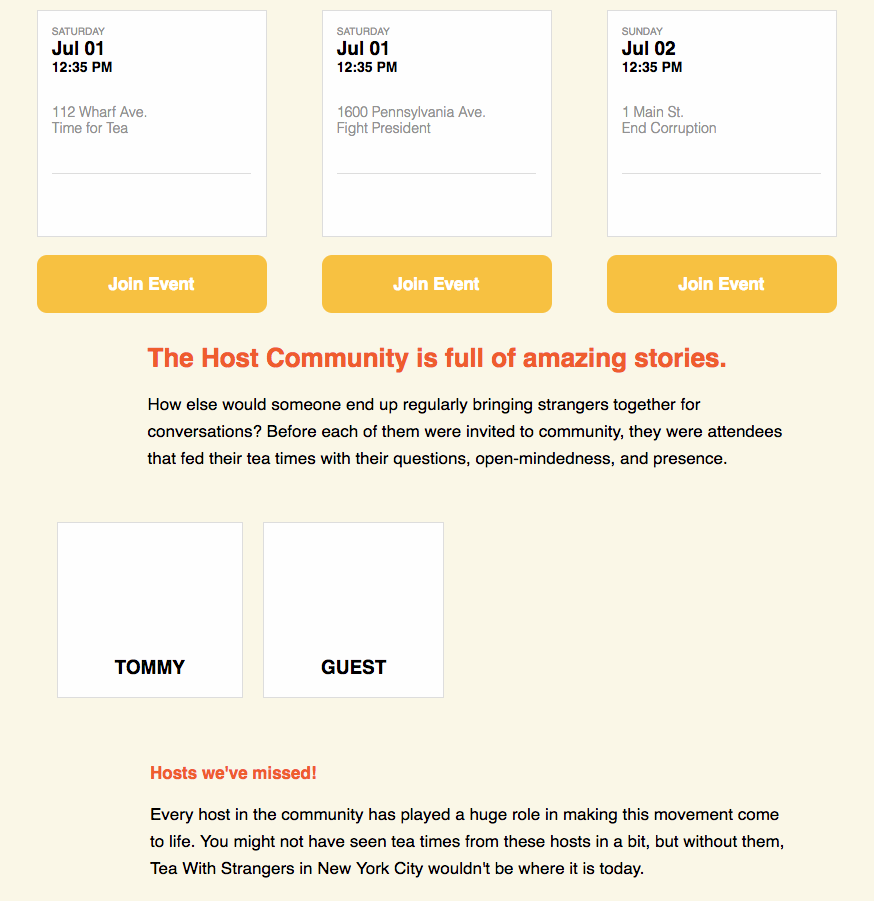
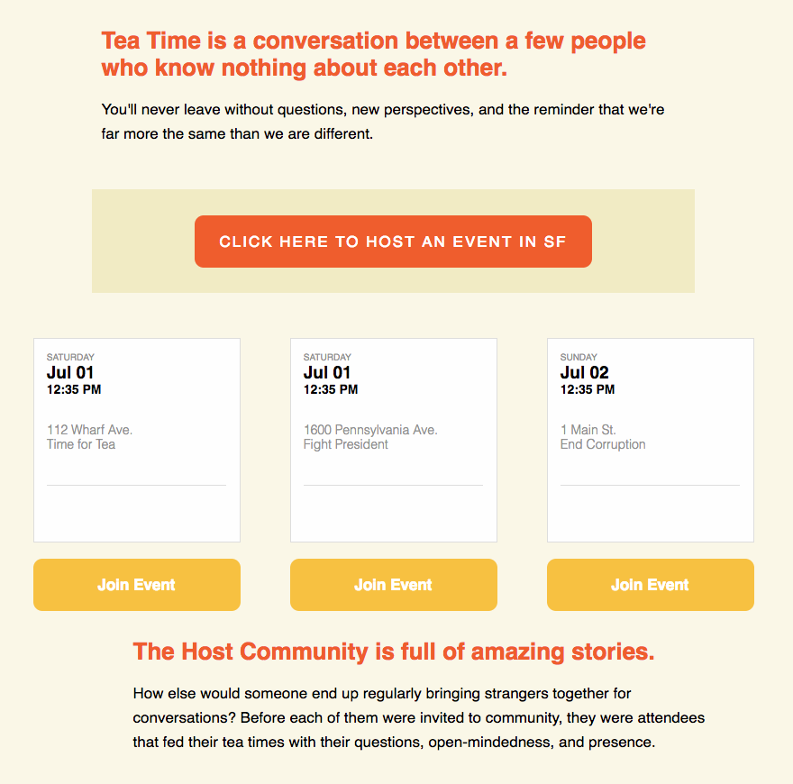
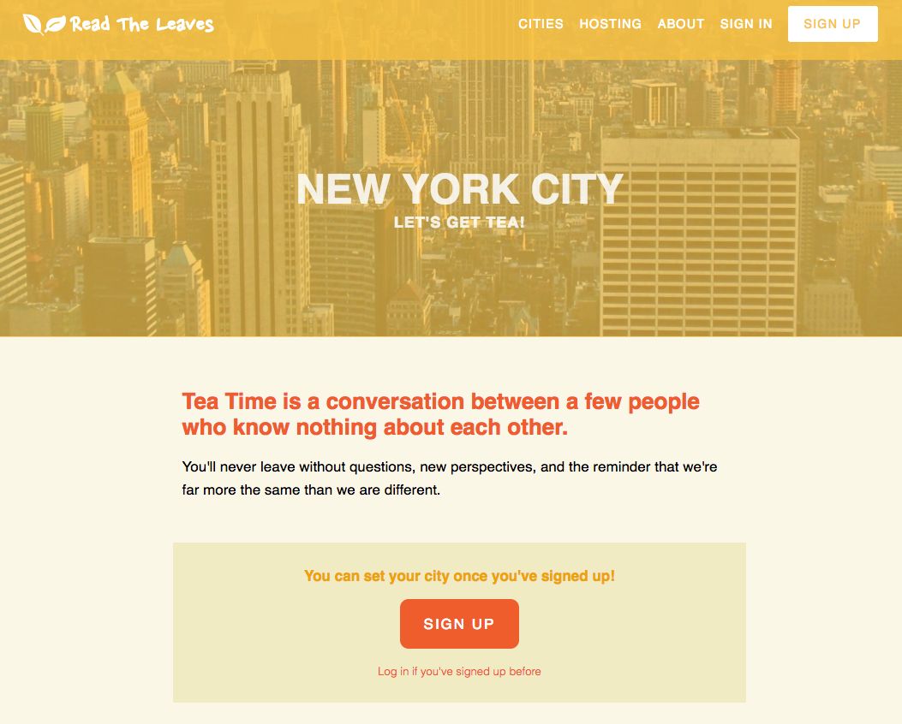
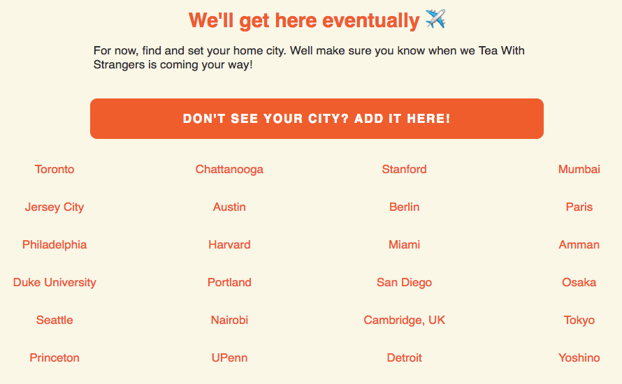

# Read The Leaves

[Read The Leaves](https://readtheleaves.herokuapp.com/)

Read The Leaves is a casual meetup app based on TeaWithStrangers, created by Ankit Shah. It's backend was built using Ruby on Rails with a PostgreSQL database. It uses React.js with a Redux architectural framework to create the frontend. Users (strangers) create accounts to join tea times which are hosted by one user that isn't a stranger (a host), and has their own profile and bio. Each user has a personal dashboard that keeps track of their previous attendances and events.

## Features and implementation

### Attend Tea Times

The core feature of this application is anonymously joining tea times, in a given city.

---
Once they join, a user may leave the event at any time for any or no reason. If the event is currently full the user will be added to a waitlist and will be added to the event if another user should leave.

---

### Host Tea Times

Users that become hosts are no longer strangers and can create their own profile with a profile pic and personal bio. They can host (create) events and cancel them for any reason. In addition to a time, date, and place, an event can also have a description which provides a theme for the tea time or to serve as a general icebreaker.

---

### User Sign Up & Authentication

But we're getting ahead of ourselves.

**First and foremost**, users must sign up to attend tea times and pick a home city. Despite being a casual meetup app, user passwords are hashed on the backend using encryption, and the resulting digest is stored in the database. This adds an extra layer of security as user passwords are never actually stored in the database.

---

### Attend

After signing up users will choice their home city and can now attend tea times. If a user cannot find their home city they may suggest a new potential home city for Read The Leaves to host tea times in.

---

## Features for implementation

Currently, still under development, future builds will include:

#### Event confirmation

User tea time attendance and absence confirmation.

#### User & Host profile and dashboard

Ability for users to become hosts, and for hosts to be able to host events.

#### Google Map API implementation

The ability for strangers to find events in their current city based on map location vs. individual city details.
