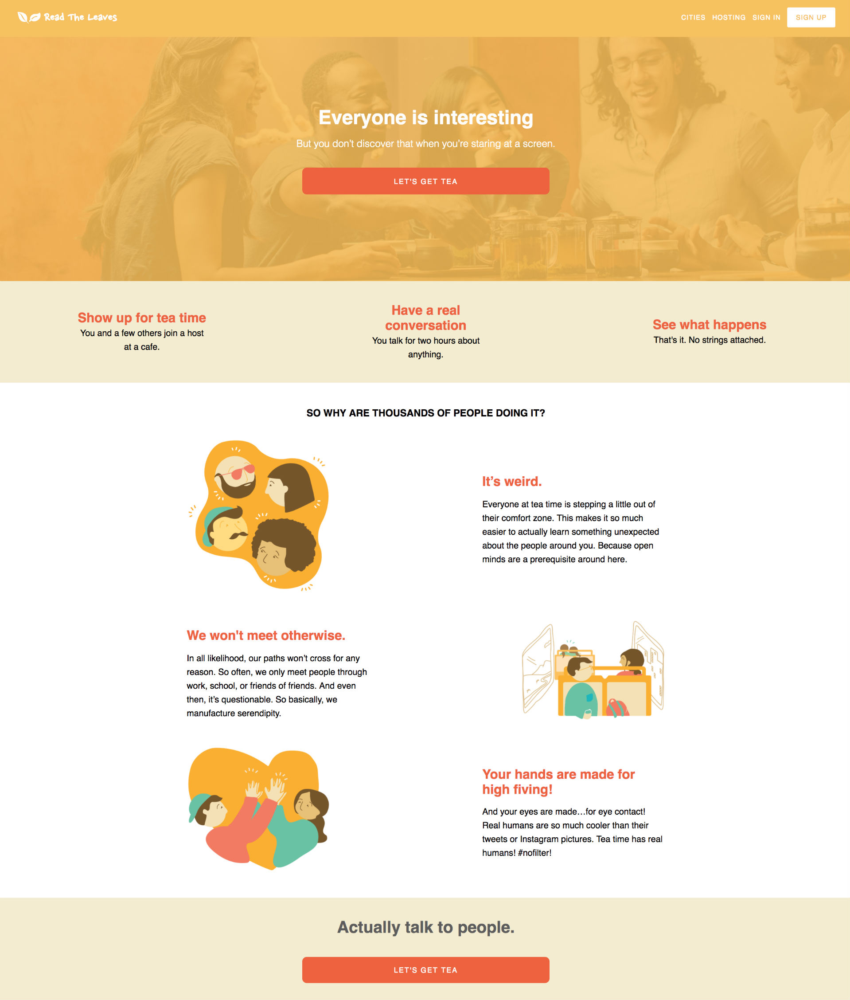
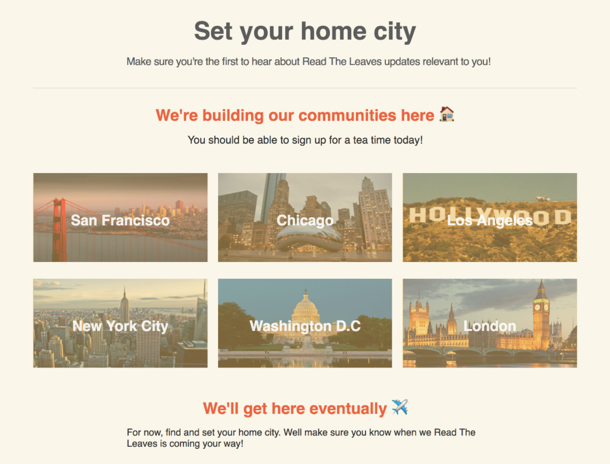

# Read The Leaves

[Read The Leaves](https://readtheleaves.herokuapp.com/)


Inspired by TeaWithStrangers, ReadTheLeaves is a single-page web application where users can casually meet up for different events. It was built with Ruby on Rails, JavaScript (ES5/ES6), React and Redux.



## Features and Implementation

### Select a City

After joining, a user chooses a home city from the CityIndex Component.



### CityDetail

The CityDetail Component conditionally render an notification button which offers:
+ Logging in or signing up
+ Choosing a Home City
+ Changing Home City
+ Hosting an event in that City

It also renders an EventIndex Component which is a array of EventItems for all events in that city.

```javascript
renderEventList() {
  const { currentUser, attendEvent, leaveEvent, removeEvent } = this.props;
  const { events } = this.props.city;

  return (
    <div>
      <EventIndex
        events={events}
        user={currentUser}
        attendEvent={attendEvent}
        leaveEvent={leaveEvent}
        removeEvent={removeEvent} />
    </div>
  );
}
```

### Attending Events

Users can attend or leave events at any time before the event occurs. Events have a default value of 5 spots for attendees. If the event is currently full, users will be unable to join.


### EventItem

Events maintain their own slice of state in the Redux store, with each event also maintaining its own internal state. This ensures that updating the state of a single EventItem will not trigger a re-render of all EventItems.

```javascript
this.state = {
  date: undefined,
  address: '',
  description: '',
  city_id,
  city_name,
  spots: 5
};
```

### Hosting and Updating Events

Users can host events in any city, not just their home. Events require a time and address. They can also take an optional description.


### EventForm

Initially, the Event's date is set as a `moment` object. When the host picks a date and time, the moment object will be validated to ensure it cannot be a past time.

```javascript
getValidTimes(dateTime) {
  if (dateTime instanceof moment) {
    if (moment().isSame(dateTime, 'day')) {
      // date is today, so only allow future times
      return {
        hours: {
          min: dateTime.hours(),
          max: 23,
          step: 1,
        },
        minutes: {
          min: dateTime.minutes(),
          max: 59,
          step: 5,
        },
      };
    }

    // date is in the future, so allow all times
    return {
      hours: {
        min: 0,
        max: 23,
        step: 1,
      },
      minutes: {
        min: 0,
        max: 59,
        step: 1,
      },
    };
  }
};  
```
A handleSubmit function formats the moment object into a JavaScript `Date` object so it can be converted into a Rails `DateTime` value.

If the event already exists, the Eventform's state will automatically be set to the events pre-existing values.

---

### User Profile

Users can view their own and other user profiles. They can join events other users are hosting from their profile page. Users can edit and cancel events they're hosting on their profile page.


---

### User Dashboard

The dashboard offers access to both hosted and attending events. Users can edit, cancel, and leave events from this page.


---

## Features for implementation

#### Google Map API implementation


The ability for strangers to find events in their current city based on map location vs. individual city details.
